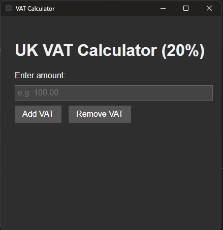
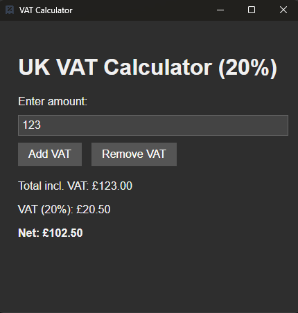
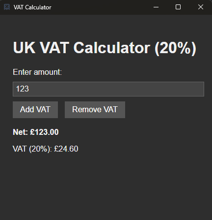

\# VAT Calculator


\*\*VAT Calculator\*\* is a simple, portable desktop app for calculating UK VAT at 20%. Built with \[Electron](https://www.electronjs.org/), it runs as a standalone `.exe` — no installation required.


---


\## 🧮 Features


\- Add or remove VAT at 20%

\- Clean, responsive interface

\- Fully offline and portable

\- No installation needed


---

\## Screenshots





---


\## 📦 Download


Head to the releases page to download the latest version:


\- ✅ `VAT Calculator.exe` — portable version, just run it

\- 🔒 No internet required

\- 🚫 No dependencies


---


\## 💻 Development

\### Requirements


\- \[Node.js](https://nodejs.org/)

\- \[Electron](https://www.electronjs.org/)

\- \[Electron Builder](https://www.electron.build/)


\### Run the app locally


```bash

npm install

npm start


